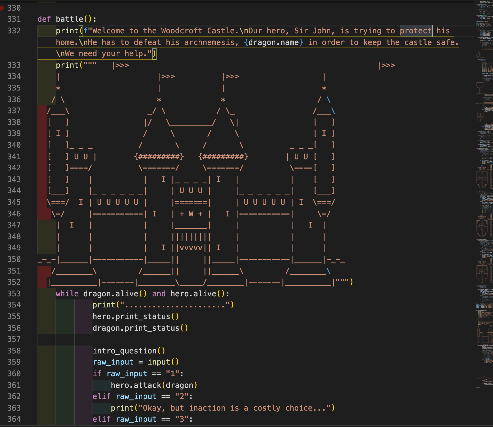
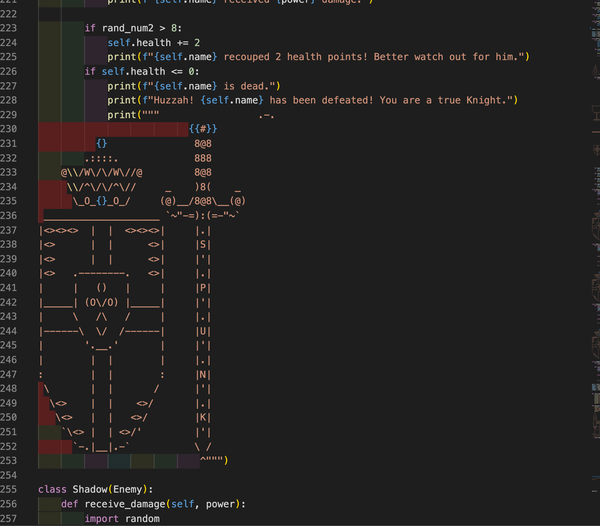

## **RPG GAME**

## **Overview**
This battle-themed role-playing game was my first Python coding project. It is deployed solely in the terminal, promting the player to select the next stage of the game for themselves. 
Below is an image of the main function that controls the game. Using a while loop, the user inputs a number for which action they wish to take next in the game. Until the hero runs out of points, the player will continue through the loop battling it out in the terminal. 
The use of classes allowed for new enemy characters to be included in the game. 
At this point in the game, the enemy of the hero is hard-coded each time. In the future, an additional feature could be added so that the player is able to choose who they battle each round. 

In order to give the game a little more excitement, ASCII art was added in so that the player can experience the inner world of the game including the castle they are protecting and the sword and shield they are wielding against the enemy. 

 
